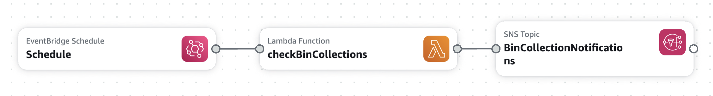
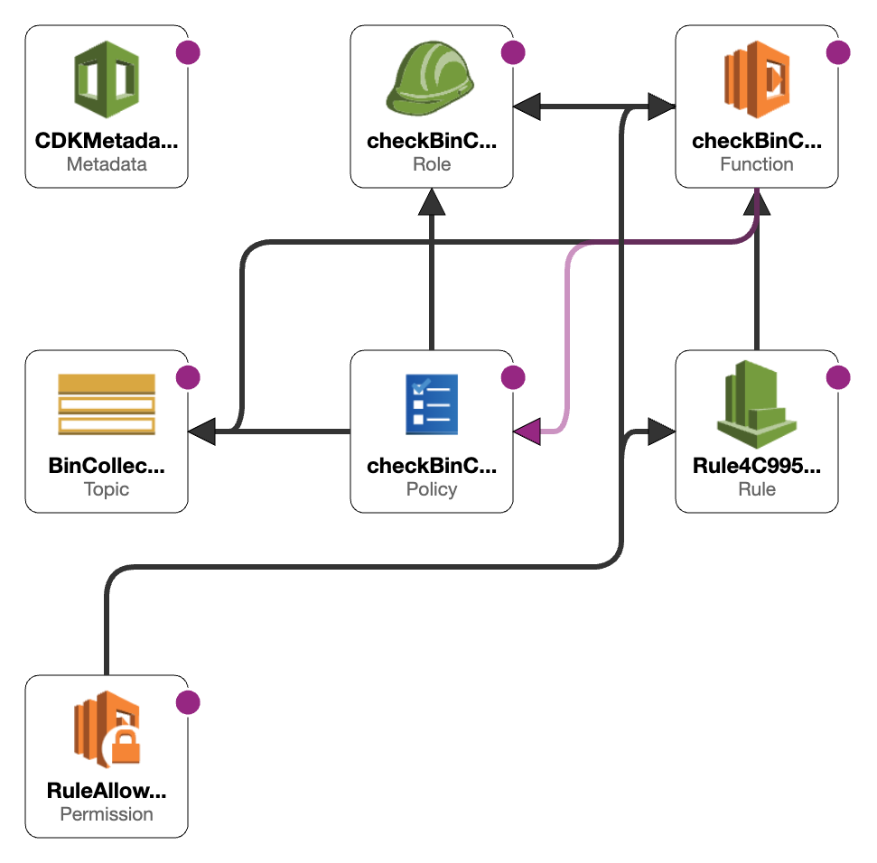

# AWS Bin Reminder Notifications

This project is a simple AWS CDK stack that sends a reminder notification to a user when the bin is due to be collected.

## Architecture

The architecture of the project is as follows:

1. A CloudWatch Event Rule is created that triggers a Lambda function every day at 6pm.
2. The Lambda function checks the day of the week and sends a notification to the user if the bin is due to be collected the next day.
3. The notification is sent via SNS.

Below you can see the AWS resources created through CDK in CloudFormation. The diagram is created using the CloudFormation Designer which is a visual tool to design and create CloudFormation templates. You can access the CloudFormation Designer by going to the CloudFormation service in the AWS Management Console and clicking on the "Design template" button.

## Useful commands

- `npm run build` compile typescript to js
- `npm run watch` watch for changes and compile
- `npm run test` perform the jest unit tests
- `npx cdk deploy` deploy this stack to your default AWS account/region
- `npx cdk diff` compare deployed stack with current state
- `npx cdk synth` emits the synthesized CloudFormation template

## Deployment

To deploy the stack, you need to have the AWS CLI installed and configured with your AWS account. You can install the AWS CLI by following the instructions [here](https://docs.aws.amazon.com/cli/latest/userguide/cli-chap-install.html).

Additionally this project will be deployed using a GitHub Actions workflow. The workflow will be triggered when a new commit is pushed to the `main` branch.
